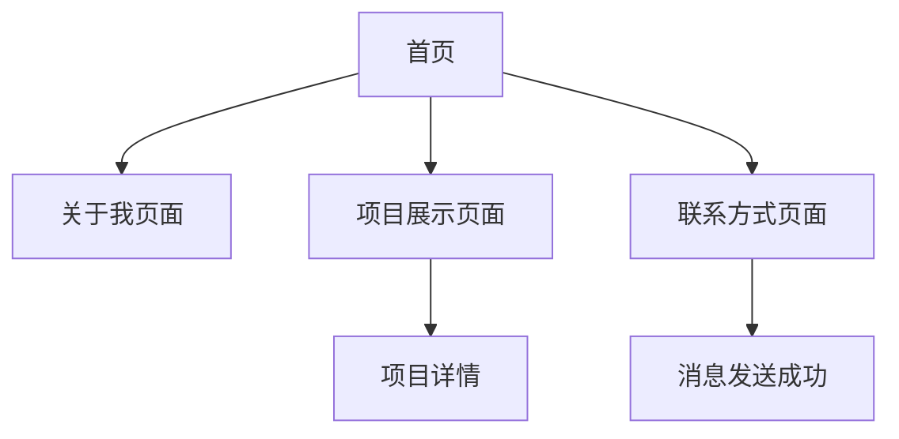

## 1. 产品概述
现代响应式个人作品集网站，展示个人技能、项目作品和联系方式。为设计师、开发者和创意工作者提供专业形象展示平台，帮助建立个人品牌和职业机会。

## 2. 核心功能

### 2.1 用户角色
| 角色 | 注册方式 | 核心权限 |
|------|----------|----------|
| 访客用户 | 无需注册 | 浏览所有页面内容、查看项目详情、发送联系信息 |
| 管理员 | 密码保护的后台登录 | 编辑个人信息、管理项目作品、更新联系方式 |

### 2.2 功能模块
网站包含以下主要页面：
1. **首页**：英雄区展示、导航菜单、个人简介预览、精选项目展示。
2. **关于我页面**：详细介绍、技能展示、工作经历、教育背景。
3. **项目展示页面**：项目列表、项目详情、技术栈标签、项目链接。
4. **联系方式页面**：联系表单、社交媒体链接、直接联系方式。

### 2.3 页面详情
| 页面名称 | 模块名称 | 功能描述 |
|----------|----------|----------|
| 首页 | 英雄区 | 展示个人姓名、职业头衔、简短介绍，包含动态背景效果 |
| 首页 | 导航菜单 | 响应式导航栏，包含页面跳转链接和移动端汉堡菜单 |
| 首页 | 精选项目 | 展示3-4个精选项目，包含项目图片、标题、简短描述 |
| 关于我页面 | 个人介绍 | 详细个人简介，包含头像、职业经历、个人价值观 |
| 关于我页面 | 技能展示 | 技术技能分类展示，包含技能熟练度指示器 |
| 关于我页面 | 时间轴 | 工作经历和教育经历的时间轴展示 |
| 项目展示页面 | 项目过滤器 | 按技术栈或项目类型筛选项目 |
| 项目展示页面 | 项目卡片 | 项目缩略图、标题、技术标签、项目链接 |
| 项目展示页面 | 项目详情模态框 | 详细项目描述、技术栈、项目截图、源代码链接 |
| 联系方式页面 | 联系表单 | 姓名、邮箱、主题、消息内容的表单提交 |
| 联系方式页面 | 社交媒体 | GitHub、LinkedIn、邮箱等社交链接图标 |

## 3. 核心流程
用户访问流程：
访客用户访问首页 → 浏览英雄区和个人简介 → 查看精选项目 → 点击导航访问其他页面 → 查看完整项目列表 → 通过联系页面发送消息。

## 4. 用户界面设计

### 4.1 设计风格
- 主色调：深蓝色 (#1e3a8a) 和白色 (#ffffff)
- 强调色：青色 (#06b6d4) 用于按钮和链接
- 按钮样式：圆角矩形，悬停时有轻微阴影效果
- 字体：主要使用 Inter 字体，标题使用较大字号 (32-48px)，正文 16px
- 布局风格：现代化卡片式布局，充足的留白空间
- 图标风格：使用简洁的线性图标，与整体设计风格保持一致

### 4.2 页面设计概述
| 页面名称 | 模块名称 | UI元素 |
|----------|----------|--------|
| 首页 | 英雄区 | 全屏渐变背景，居中显示个人信息，包含打字机动画效果 |
| 首页 | 导航栏 | 固定在顶部，滚动时半透明背景，移动端显示汉堡菜单 |
| 关于我页面 | 技能展示 | 圆形进度条显示技能熟练度，悬停显示技能名称 |
| 项目展示页面 | 项目卡片 | 网格布局，鼠标悬停时有放大效果，显示项目标签 |
| 联系方式页面 | 联系表单 | 简洁的输入框设计，提交按钮有加载状态 |

### 4.3 响应式设计
采用桌面优先设计策略，完全响应式布局：
- 桌面端：1200px 以上，多列网格布局
- 平板端：768-1199px，适当调整列数和间距
- 移动端：小于 768px，单列布局，触摸优化的按钮和交互元素
- 支持视网膜屏幕的高清图片显示

### 4.4 动画效果
- 页面滚动时的淡入动画
- 技能进度条的加载动画
- 项目卡片的悬停缩放效果
- 表单提交的加载状态动画