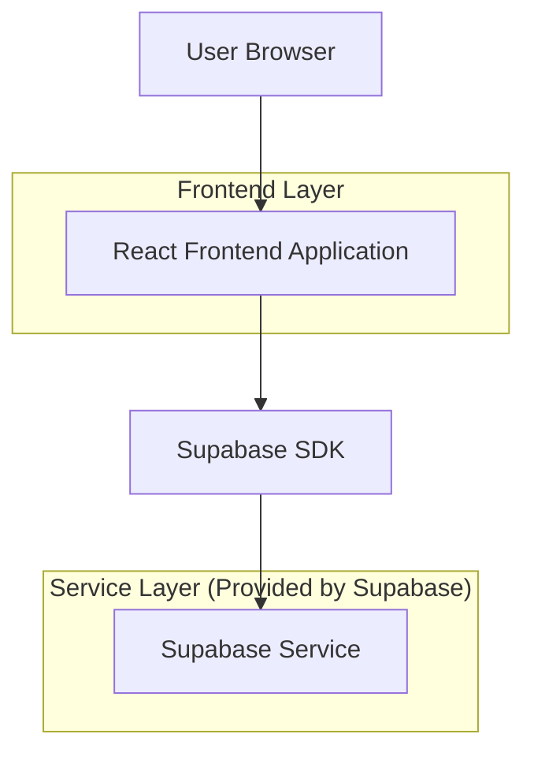
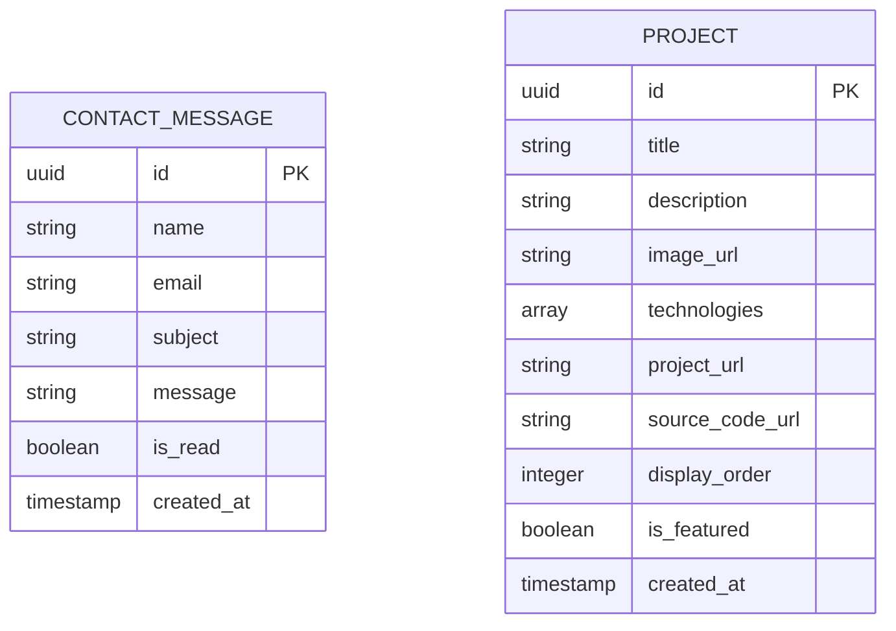

## 1. 架构设计



## 2. 技术描述

- 前端：React@18 + tailwindcss@3 + vite
- 初始化工具：vite-init
- 后端：Supabase (用于联系表单数据存储)

## 3. 路由定义

| 路由 | 用途 |
|-------|---------|
| / | 首页，展示英雄区和精选项目 |
| /about | 关于我页面，展示个人信息和技能 |
| /projects | 项目展示页面，展示所有项目作品 |
| /contact | 联系方式页面，包含联系表单 |

## 4. 数据模型

### 4.1 数据模型定义



### 4.2 数据定义语言

联系消息表 (contact_messages)
```sql
-- 创建表
CREATE TABLE contact_messages (
    id UUID PRIMARY KEY DEFAULT gen_random_uuid(),
    name VARCHAR(100) NOT NULL,
    email VARCHAR(255) NOT NULL,
    subject VARCHAR(200) NOT NULL,
    message TEXT NOT NULL,
    is_read BOOLEAN DEFAULT FALSE,
    created_at TIMESTAMP WITH TIME ZONE DEFAULT NOW()
);

-- 创建索引
CREATE INDEX idx_contact_messages_created_at ON contact_messages(created_at DESC);
CREATE INDEX idx_contact_messages_is_read ON contact_messages(is_read);

-- 授权访问
GRANT SELECT ON contact_messages TO anon;
GRANT INSERT ON contact_messages TO anon;
GRANT ALL PRIVILEGES ON contact_messages TO authenticated;
```

项目表 (projects)
```sql
-- 创建表
CREATE TABLE projects (
    id UUID PRIMARY KEY DEFAULT gen_random_uuid(),
    title VARCHAR(200) NOT NULL,
    description TEXT NOT NULL,
    image_url VARCHAR(500),
    technologies TEXT[],
    project_url VARCHAR(500),
    source_code_url VARCHAR(500),
    display_order INTEGER DEFAULT 0,
    is_featured BOOLEAN DEFAULT FALSE,
    created_at TIMESTAMP WITH TIME ZONE DEFAULT NOW()
);

-- 创建索引
CREATE INDEX idx_projects_display_order ON projects(display_order);
CREATE INDEX idx_projects_is_featured ON projects(is_featured);
CREATE INDEX idx_projects_created_at ON projects(created_at DESC);

-- 授权访问
GRANT SELECT ON projects TO anon;
GRANT ALL PRIVILEGES ON projects TO authenticated;
```